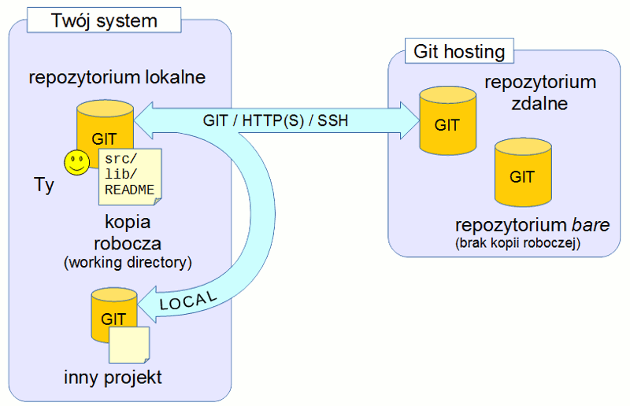

# Wprowadzenie do Gita

## Spis treści

1. [Wstęp](#wstep)
2. [Ogólnie o Gicie](#ogólnie-o-gicie)
3. [Podstawy Gita](#podstawy-gita)
4. [Repozytoria zdalne](#repozytoria-zdalne)

## Wstęp

Na początek parę słów wyjaśnienia. Niniejszy artykuł nie jest ani tutorialem krok po kroku, ani pełnym podręcznikiem. Czego zatem możesz się spodziewać?

* po polsku
* krótko i tylko najważniejsze zagadnienia
* dużo ilustracji

Jeśli chcesz czegoś jeszcze bardziej "w pigułce", to polecam `$ git help`. Jeśli chcesz materiału pełnego i szczegółowego, to odsyłam do oficjalnej książki o Gicie [dostępnej online](http://git-scm.com/book/en/v2) (po angielsku).

#### Treść

Jeśli potrzebujesz tylko ogólnego opisu czym jest Git i jakie są jego najważniejsze cechy, to przeczytaj drugi rozdział (Ogólnie o Gicie).

W kolejnym rozdziale (Podstawy Gita) wprowadzone są podstawy niezbędne by pracować z Gitem i jest on potrzebny by zrozumieć treść rozdziału czwartego (Repozytoria zdalne), który opisuje tematy pojawiające się w pracy zespołowej z Gitem.

Aby w pełni zrozumieć jak korzysta się z danej funkcjonalności będziesz musiał posłużyć się wbudowanym helpem (w wierszu polecenia), albo materiałami dostępnymi online na stronie Gita: http://git-scm.com/docs

## Ogólnie o Gicie

#### Czym jest Git?

Git to oprogramowanie kontroli wersji (SCM - Source Control Management, albo VCS - Version Control System).

Tego typu program pozwala śledzić zmiany w Twoim projekcie, co ułatwia pracę zespołową nad kodem i ogólnie rozwój oprogramowania (nawet dla jednego developera). Daje dostęp do historii zmian umożliwiając kontrolę nad tym co i kiedy zostaje zmienione.

Git zyskał dużą popularność ze względu na swoją wielką elastyczność i w pewnym sensie prostotę zasad działania, co niekoniecznie przekłada się na łatwość użycia. Choć Git jest bardzo intuicyjny dla osób już z nim obeznanych, to notorycznie okazuje się trudny do zrozumienia dla początkujących.

Istnieje wiele programów alternatywnych do Gita, np. CVS, Subversion (SVN), Perforce (P4), oraz Mercurial (hg). Oczywiście każdy z nich działa na często bardzo różnych zasadach.

Więcej informacji: http://git-scm.com/book/en/v2/Getting-Started-About-Version-Control

#### Git działa offline

Wszystkie główne funkcjonalności Gita używane w typowej pracy nad projektem programistycznym działają bez połączenia z siecią.

Zapisywanie zmian w repozytorium, przeglądanie historii zmian, porównywanie wersji, wyciąganie starych wersji plików, itd. to wszystko działa offline.

Jest to kluczowa cecha, która sprawia, że Git jest bezkonkurencyjnie szybki w porównaniu np. z SVN'em i pozwala na pracę bez przeszkód w sytuacji gdy łączność z internetem jest ograniczona.

#### Git jest rozproszony (distributed)

Git działa offline, co więcej, nie wymaga żadnej zewnętrznej usługi (serwera, czy centralnego repozytorium) by działać i być przydatnym.

Każde repozytorium Gita (dla danego projektu) jest praktycznie pełną kopią zawierającą historię projektu od samego początku jego istnienia. Dodatkowo może zawierać zmiany utworzone lokalnie przez developera.

Poszczególni programiści mogą pracować pobierając od siebie zmiany, a żadne z repozytoriów nie jest wyróżnione ("ważniejsze" od drugiego).


#### Git jest elastyczny

W środowiskach korporacyjnych Git jest zwykle używany w sposób scentralizowany, podobnie jak SVN, z dodatkowym zyskiem w postaci tego, że każde repozytorium jest pełną kopią zapasową projektu.

Tego typu konfiguracja jest zwykle realizowana poprzez użycie jednego z rozwiązań serwerowych dla Gita, np. Gerrit, Stash, GitHub, GitLab, itp. które umożliwiają kontrolę nad uprawnieniami dostępu, kontami użytkowników, i często też pozwalają na recenzowanie kodu (code review).

Ponieważ Git jest rozproszony, to często staje się narzędziem wybieranym przez projekty Open Source, w których centralne zarządzanie uprawnieniami byłoby męczące i utrudniałoby współpracę.

Strony społecznościowe takie jak GitHub wspierają ten styl pracy nad projektem (ale nie jest to jedyny sposób).

Więcej informacji: http://git-scm.com/about/distributed

#### Git jest potężny

Zanim zaczniesz doceniać Gita, musisz nauczyć się podstaw. Funkcje, które tradycyjnie były wolne lub nieporęczne w użyciu (jak branche), w Gicie są szybkie i "lekkie".

Wiele dużych i rozpoznawalnych projektów oraz firm używa Gita (Android OSP i jądro Linux, by wymienić choć dwa). Git jest zdecydowanie przyjazny dla ekspertów, ale po zapoznaniu się z podstawami nawet początkujące osoby mogą używać go efektywnie (najlepiej z okazyjnym wsparciem bardziej doświadczonych użytkowników).

## Podstawy Gita

#### Jak zacząć?

Zależnie od systemu operacyjnego z którego korzystasz, sposoby pozyskania Gita są różne.

* GNU/Linux
  * użyj managera pakietów Twojej dystrybucji i pobierz paczki:
    * git
    * gitk
* Windows
  * ściągnij instalkę z http://git-scm.com/
* Mac OS X
  * Git powinien być zainstalowany razem z narzędziami Xcode

Kroki, które trzeba wykonać po instalacji opisane są tutaj: http://git-scm.com/book/en/v2/Getting-Started-First-Time-Git-Setup

Wprowadźmy teraz kilka pojęć Gita.

#### Projekt i kopia robocza (working directory)

Jest to katalog na Twoim komputerze, w którym znajduje się projekt (kod źródłowy). Tutaj modyfikowane są pliki i trwa standardowa praca nad projektem. Katalog projektu jest jednocześnie kopią roboczą (working directory) Gita, czyli miejscem objętym kontrolą wersji.

#### Repozytorium lokalne

W tym miejscu Git zapisuje wszystkie zmiany wprowadzone w projekcie. Zwykle jest to katalog o nazwie `.git` i znajduje się w korzeniu katalogu projektu.

#### Staging (index)

Aby zapisać zmianę, należy wskazać które pliki (i w jakim stanie) powinny zostać uwzględnione. Proces ten nazywamy stage'owaniem pliku lub dodaniem do indeksu. Dodatkowo Git pozwala porównywać stan plików między kopią roboczą, indeksem, a tym co już zostało zapisane w repozytorium.

Warto zwrócić uwagę, że plik będzie zapisany w takim stanie jak w momencie dodania go do indeksu. Nawet jeśli zmienimy zawartość pliku, to Git i tak pamięta jego poprzednią wersję i to ona będzie zapisana. W praktyce zwykle pliki dodaje się do indeksu bezpośrednio przed wykonaniem zapisu do repozytorium.

#### Commit (migawka)

Zmiana stanu repozytorium w danej chwili czasu nazywana jest commitem. Używa się też nazwy migawka (snapshot), ponieważ commit tak jak zdjęcie utrwala pewien stan całości projektu w danej chwili. Należy podkreślić, że dla Gita commit to zawsze pełny, spójny stan całego projektu, a nie tylko kilku wybranych plików.

W praktyce każdy commit zawiera tylko minimalne informacje niezbędne do zmiany stanu repozytorium względem poprzedniego commita.

#### Praca z Gitem


#### Dodawanie plików (staging)

Pliki w kopii roboczej mogą znajdować się w różnym stanie, który sprawdzamy poleceniem `status`.


*oryginalna ilustracja: Git Book* http://git-scm.com/book/en/v2

* Untracked - nowo utworzone pliki, Git jeszcze o nich nie wie
* Unmodified - pliki, które zostały scommitowane do repozytorium
* Modified - pliki, które zostały scommitowane, ale są obecnie zmodyfikowane
* Staged - nowe lub zmodyfikowane pliki, które przygotowaliśmy do commita

Nawet skasowane pliki trzeba dodać do indeksu, aby Git zapisał w commicie fakt ich usunięcia.

#### Commit

Jak już zostało wspomniane, commit to spójny stan całości projektu w danej chwili czasu.


Cechy commita:

* Nie można go modyfikować
* Pozostaje na zawsze\*
* Wskazuje na wcześniejszy commit (lub commity)
* Ma unikatowy hash
* Zawiera opis
* Ma autora, datę utworzenia, czas, itp.

\* Pozostaje na zawsze - gdy raz utworzysz commit, pozostaje on w repozytorium nawet jeśli go nie widzisz.

#### Tworzenie commita

Zmiany w repozytorium zawsze odnoszą się do poprzedniego stanu repozytorium. Powiedzmy że mamy jeden plik w naszym projekcie:


Edytujemy ten plik dodając więcej tekstu.


Git widzi tą modyfikację: (polecenie `diff` -- dodano jedną linię)

```
diff --git a/readme.txt b/readme.txt
index af5626b..cce1c8b 100644
--- a/readme.txt
+++ b/readme.txt
@@ -1 +1,2 @@
 Hello, world!
+Hi!
```

Teraz możemy dodać plik do indeksu poleceniem `add` (staging), a następnie utworzyć nowy commit, poleceniem `commit`.

Wewnątrz commita zapisana będzie informacja, że do pliku readme.txt dodano nową linię. Ta zmiana nie może istnieć bez commita-rodzica, który zawierał poprzednią wersję pliku readme.txt.

#### Niezmienność commitów

Pamiętaj, że commitów nie da się modyfikować.

Oznacza to, że *jakakolwiek* zmiana commita, czy to dodanie/usunięcie/modyfikacja pliku, poprawka opisu, zmiana commita-rodzica, wszystkie te operacje powodują utworzenie nowego commita. Często czynimy ten "skrót myślowy" mówiąc, że modyfikujemy commit, ale w rzeczywistości tworzymy nowy commit, bardzo podobny do oryginalnego.

Ma to wpływ na szereg operacji w Gicie, czasem z zaskakującym efektem dla osób nie zaznajomionych z Gitem. Pamiętaj o tym w miarę jak będziemy iść do przodu z materiałem.

Warto też zaznaczyć, że efektem ubocznym tego że commity nie są modyfikowane ani kasowane jest to, że w Gicie bardzo trudno coś "popsuć". Zawsze istnieje możliwość odzyskania poprzedniej wersji zmiany.

#### Commity tworzą historię (log)

Większość commitów wskazuje na swoich rodziców, co sprawia że w naturalny sposób tworzą one hierarchiczną, drzewiastą strukturę. Pierwszy commit nie ma rodzica, ponieważ jest pierwszym commitem w pustym repozytorium. Najnowszy commit znajduje się na górze.


#### Historia

Historia zmian repozytorium (log) zwykle przedstawiana jest graficznie w ten sposób:


Najnowszy commit jest widoczny na górze. Etykieta **master** jest nazwą brancha (gałęzi). Commity są zwykle zorganizowane w ciąg pod jednym lub kilkoma branchami.

**gitk** jest świetnym narzędziem do wizualizacji i przeglądania loga. W trybie tekstowym log możemy wywołać poleceniem `log`.

O branchach zwykle myślimy jak o wątkach pracy w repozytorium, określających temat zmian. Używamy ich do organizowania pracy i nawigowania w projekcie, zwłaszcza jeśli pracujemy nad konkretną funkcjonalnością, naprawiamy buga, albo chcemy oddzielić pewną część kodu od reszty projektu.

Branche w Gicie są niezwykle "lekkie". Praktycznie można traktować je jak etykietki przypięte do poszczególnych commitów. Wszystkie inne informacje (np. kolejność commitów) zapisane są bezpośrednio w samych commitach.

#### Korygowanie ostatniego commita

Bardzo często zachodzi potrzeba poprawy ostatnio utworzonego commita. Być może zapomnieliśmy dodać jeszcze jednego pliku, albo zauważyliśmy literówkę.

Korekty dokonujemy poleceniem `commit --amend`. Stary commit `a` zostaje odrzucony (ale zostaje gdzieś w repozytorium), a w jego miejsce powstaje nowy `a1`, zawierający poprawki.


Ponieważ branch master wskazuje teraz na commit `a1`, commit `a` przestaje być dla nas widoczny.

#### Więcej niż jeden branch

W nowo utworzonym repozytorium znajduje się tylko jeden branch, domyślnie master. Bardzo często jednak repozytoria zawierają wiele branchy.


Branche mogą przenikać się nawzajem, a każdy z commitów reprezentuje spójny stan całego repozytorium w danej chwili czasu.

Najnowszy commit na danym branchu nazywany jest commitem HEAD (na rysunku zaznaczony na żółto lub niebiesko).

Gdy tworzymy nowy commit, jest on "umieszczany" na **aktywnym branchu**. Tylko jeden branch może być w danym momencie aktywny. W przykładzie na rysunku jest to branch master (zaznaczony na żółto).

Pamiętaj, branch to tylko etykietka na commicie, nic więcej.

Mimo to wygodnie jest myśleć o branchu jako o narzędziu organizującym naszą pracę. Gdy tworzymy commit, jest on umieszczany nad poprzednim commitem, a branch jest automatycznie przesuwany tak by wskazywał na commit który właśnie utworzyliśmy.

Co ciekawe, nie potrzebujemy brancha aby utworzyć commit, ale tego typu sytuacje zdarzają się raczej rzadko.


#### Odwoływanie się do commitów

Aby skutecznie poruszać się po historii repozytorium (np. aby zobaczyć wcześniejszą wersję pliku), możemy odwoływać się do commitów na różne sposoby.


* master - za pomocą nazwy brancha
* HEAD - czubek aktywnego brancha
* eb32a79 - poprzez hash commita (unikatowy identyfikator)
* \~, albo ~N - oznacza N commitów wcześniej, np. HEAD~2 dwa commity wcześniej od HEAD'a (czyli trzeci od góry)
* ^ - podobnie jak ~, ale pozwala wybrać commita-rodzica (gdy jest więcej niż jeden).

#### Integracja (scalanie branchy)

Branche pozwalają rozdzielić pracę, np. trzymać eksperymentalny kod poza stabilnym rdzeniem projektu.

W końcu przychodzi jednak moment, w którym chcemy połączyć to co zostało wyprodukowane na innym branchu z resztą kodu, np. gdy nowa funkcjonalność jest już ukończona.


Git daje nam dwie główne metody integrowania wątków pracy: **merge** i **rebase**.

* Merge polega na utworzeniu nowego commita, który łączy dwa (lub więcej) branchy (ma kilka parentów).
* Rebase to operacja, która tworzy serię nowych commitów na docelowym branchu, które wprowadzają identyczne zmiany jak te na źródłowym branchu ("przenosi" commity).

#### Merge

Master to aktywny branch. Merge'ujemy (polecenie `merge`) foobar do mastera. Nowo utworzony commit `f` ma dwóch parentów: `a` i `c`. Stan kopii roboczej w commicie `f` jest połączeniem stanów `a` i `c`.


Ponieważ merge'owaliśmy foobar do mastera, to stan na branchu foobar nie ulega zmianie po tej operacji. Foobar nadal nie ma dostępu do zmiany `c` z mastera.

#### Fast-forward merge

Istnieje szczególny przypadek mergea, który nazywamy **fast-forward** ("przewinięcie do przodu").

Jeśli master jest podzbiorem foobara (nie "rozbiegł" się z foobarem i nie ma rozgałęzienia), wtedy branch jest po prostu przenoszony w nowe miejsce. Nie jest tworzony nowy commit.


#### Rebase

Foobar to aktywny branch. Oddzielił się od mastera i teraz chcemy go zaktualizować (uzyskać dostęp do nowych zmian na masterze). Rebase'ujemy foobar na czubek mastera.

Wynikiem tej operacji jest nowy zbiór commitów `b1`, `d1`, a stare commity `b` i `d` zostają "odrzucone" (bo nie możemy ich modyfikować -- commity są niezmienne).


Jest to jeden z tych przypadków, w których stare commity zostają gdzieś w repozytorium, ale już ich nie widzimy, bo żaden branch się do nich nie odwołuje.

Po wykonaniu rebase'a foobar zawiera zmiany z mastera, ale master nadal nic nie wie o foobarze. Aby zmiany z foobara pojawiły się na masterze, można w tym momencie wykonać merge (który będzie merge'em fast-forward).

#### Merge vs Rebase

Decyzja której z tych operacji użyć należy do developera. Czasami te zasady są przyjęte przez zespół pracujący nad danym projektem, a czasem używa się obu metod. Programiści często preferują te metody, które prowadzą do uzyskania liniowej historii zmian, bo łatwiej się ją czyta.

Merge | Rebase
------|-------
Nigdy nie zastępuje commitów | Przenosi branch i tworzy nowe commity (przepisuje historię)
Albo fast-forward, albo tworzy pojedynczy merge commit | Nowe commity są "prawie jak" stare, ale mają innych parentów
Merge commit łączy dwa lub więcej wątków pracy (branchy) | Aplikuje zmiany commit po commicie

#### Konflikty merge'owania (integracji)

Za każdym razem gdy próbujemy połączyć dwie rozbieżne historie, pojawia się ryzyko konfliktu. Konflikt merge'owania (to ogólna nazwa, dotyczy też rebase'a) następuje gdy plik był zmodyfikowany na niezgodne ze sobą sposoby, na przykład ta sama linia została zmieniona, albo plik został skasowany na jednym branchu, a zmodyfikowany na drugim.


1. Tą zmianę wprowadzono na branchu do którego integrujemy, np. na masterze.
2. To druga zmiana, utworzona na branchu foobar.

Powtarzające się symbole <<, ==, >> to markery konfliktu, które należy ręcznie usunąć w trakcie rozwiązywania konfliktu. Przez rozwiązanie konfliktu rozumiemy taką modyfikację pliku, która przywróci go do spójnego, działającego stanu. W trakcie naprawiania konfliktu należy zachować szczególną uwagę, aby nie wprowadzić bugów i nie usunąć pracy innego programisty.

#### Konflikt podczas merge'a


Przy merge'u, wszystkie konflikty są rozwiązywane w jednym miejscu, w merge commicie. W tym przykładzie konflikt wystąpił pomiędzy commitami `b` i `c`, ale rozwiązujemy go w kontekście wszystkich zmian razem.

Gdy naprawimy konflikt, dodajemy poprawione pliki do indeksu i commitujemy tak jak normalnie, tworząc merge commit.

#### Konflikt podczas rebase'a


Rebase tworzy commity na szczycie mastera, jeden po drugim, a więc konflikty mogą pojawić się stopniowo.

Najpierw Git próbuje przenieść commit `d` na mastera, ale pojawia się konflikt pomiędzy commitami `c` i `d`. Rebase się zatrzymuje i musimy naprawić konflikt. Gdy konflikt jest już rozwiązany, możemy wznowić rebase poleceniem `rebase --continue` (w przeciwieństwie do merge'a, przy którym po prostu tworzyliśmy nowy commit). Nad commitem `a` pojawia się przeniesiony commit `d1`.

Próba przeniesienia `b` też kończy się konfliktem między `c` i `b`, a my znowu musimy wykonać te kroki co wcześniej. Ten cykl powtarza się do momentu aż przeniesione zostaną wszystkie commity z foobara.

#### Złożone konflikty i konflikty plików binarnych

Gdy pojawia się wiele konfliktów, sposób ich rozwiązania może nie być oczywisty. W takich sytuacjach możemy spróbować trzystronnego diffa, który jest jednoczesnym porównaniem wersji bazowej (wspólnej) i dwóch rozbieżnych wersji. Porównanie tego typu można wykonać w jednym pliku (podobnie jak standardowy dwustronny diff).

Przy skomplikowanych konfliktach użycie dodatkowego, graficznego narzędzia może okazać się niezbędne. Programy takie jak Meld lub KDiff3 pozwalają na wykonanie dwustronnego i trzystronnego porównania plików. Git posiada polecenie `mergetool` ułatwiające przygotowanie takiego porównania.

Git radzi sobie świetnie z plikami tekstowymi i zazwyczaj wie jak je połączyć bez zgłaszania konfliktu. Pliki binarne mogą natomiast stwarzać problemy. Istnieje kilka strategii radzenia sobie z konfliktami binarnymi:

* Porównaj obie wersje pliku ręcznie (np. otwierając je w odpowiednim edytorze) i zdecyduj którą z nich zatrzymać.
* Zaakceptuj większą zmianę a następnie ręcznie dodaj tą mniejszą.
* Przedyskutuj za wczasu z resztą teamu kto i kiedy poprawia pliki, tak aby uniknąć konfliktów.

## Repozytoria zdalne

W Gicie repozytorium zdalne (remote), to po prostu każde repozytorium, które nie jest lokalnym repozytorium.

Git posiada mechanizmy do łączenia się z remote'ami i wymienianiem się zmianami (commitami, branchami, itp.) pomiędzy nimi. Po tym jak taka wymiana miała miejsce, powracamy do standardowego trybu pracy. Poza kilkoma konkretnymi poleceniami, które potencjalnie wychodzą poza nasz komputer, w Gicie nie pracujemy "online".

Na bazie remote'ów można zaimplementować wiele metodologii pracy w Gicie (workflow'ów), które mogą polegać na prostych uzgodnieniach wewnątrz teamu, aż po rozwiązania systemowe opierające się na dodatkowym oprogramowaniu, np. GitHub albo Atlassian Stash, które dodają nowe pojęcia jak Merge (Pull) Request'y, które nie istnieją w samym Gicie.

Więcej na ten temat można przeczytać na przykład tutaj: https://www.atlassian.com/git/tutorials/comparing-workflows/

#### Local i remote



Powyżej przedstawione repozytorium lokalne "wie" o dwóch repozytoriach zdalnych.

Jedno z nich znajduje się na tym samym komputerze (w innym katalogu), podczas gdy drugie jest na innym komputerze, na przykład serwerze GitHub lub GitLab.

#### Pobieranie plików z remote'a


Jeśli posiadasz URL do repozytorium, możesz sklonować je na swój komputer.

Ta operacja spowoduje utworzenie repozytorium lokalnego na Twoim systemie, które będzie kopią zdalnego, zawierającą wszystkie zmiany od czasu powstania projektu. Lokalne repozytorium zostanie też od razu skonfigurowane do pracy z repozytorium zdalnym.

W trakcie klonowania powstają:
- commity
- branche
- tagi (etykiety, używane np. do oznaczania release'ów)
- pliki konfiguracyjne

Klonowanie jest operacją jednorazową. Od tego czasu oba repozytoria żyją swoim własnym życiem, w szczególności nie "synchronizują się" automatycznie.

#### Local i remote z bliska


Sklonowane repozytorium zwykle będzie zawierać domyślny branch (często master, ale ta nazwa nie jest specjalna), oraz jeden lub więcej *branchy zdalnych*.

Origin to domyślna nazwa dla remote'a z którego klonowaliśmy i praktycznie można ją traktować jako alias na URL zdalnego repozytorium. Podobnie jak z masterem, ta nazwa nie ma specjalnego znaczenia.

#### Local vs remote branch


Branch zdalny (zaznaczony na pomarańczowo) jest specjalnym branchem, który ma odzwierciedlać stan brancha o tej samej nazwie, ale na remote'cie (w tym przypadku na originie).

Istnieje tylko jedna istotna różnica między lokalnym i zdalnym branchem:
- branch zdalny **nie może być aktywny**.

W praktyce oznacza to, że nie możemy bezpośrednio na branchu zdalnym tworzyć commitów, a także część innych poleceń (ze względu na swoją zasadę działania) nie działa ze zdalnymi branchami.

Poza tym branch zdalny zachowuje się jak normalny, lokalny branch, w szczególności nie jest "online" i nie synchronizuje się automatycznie z branchem na remote'cie. Git posiada odpowiednie polecenia, które trzeba wywołać, aby zaktualizować stan branchy zdalnych.

#### Modyfikowanie branchy zdalnych

Skoro nie możemy tworzyć commitów na branchach zdalnych, to do czego nam one potrzebne?

Istnieją dwa podstawowe polecenia służące do modyfikowania branchy zdalnych:

* `fetch` - powoduje aktualizację wszystkich branchy zdalnych, tak żeby ich stan odpowiadał temu na remote'cie. Powoduje to pobranie nowych commitów, które pojawiły się na tych branchach. Dzięki temu możemy zobaczyć np. co nowego zrobili inni programiści w projekcie.
* `push` - modyfikuje zawartość brancha w zdalnym repozytorium, oraz jako efekt uboczny stan brancha zdalnego w lokalnym repozytorium. Po pushu inni developerzy mogą zobaczyć nasze zmiany i ściągnąć je do swoich repozytoriów. Push służy też do tworzenia nowych i kasowania istniejących branchy na remote'cie.

Możesz też użyć polecenia `pull`, które jest operacją dwa w jednym: `fetch` + `merge` (domyślnie) lub `fetch` + `rebase` (z dodatkowym parametrem).

#### Praca z remote'em


Spójrzmy na przykład działania fetcha.

Master to aktywny branch (lokalny). Zdalny branch origin/master wskazuje na ten sam commit.

Wykonujemy fetch, po którym branch origin/master przesuwa się do nowego commita, którego wcześniej nie mieliśmy w swoim repozytorium.

Zwróć uwagę, że ta operacja nie modyfikuje lokalnego mastera, i tym samym nie zmienia tego co widzimy lokalnie w kopii roboczej projektu. Ciągle znajdujemy się na commicie `a`.


#### Integrowanie pobranych zmian

Aby uzyskać dostęp do pobranych zmian, musimy jakoś je zintegrować. W naszym przykładzie możemy je po prostu zmerge'ować. Jest to merge fast-forward, o którym już była mowa wcześniej przy omawianiu lokalnych branchy.


Po merge'u w końcu widzimy nowe zmiany w kopii roboczej, a branch master ponownie zrównuje się z origin/master.

Ten sam efekt moglibyśmy uzyskać wykonując polecenie `pull` (czyli `fetch` + `merge`).

#### Konflikty a branche zdalne

Jak wspomniane było wcześniej, branche zdalne są prawie takie same jak branche lokalne. Możemy dostać konflikt w trakcie merge'owania i rebase'owania branchy lokalnych i to samo może się stać przy branchach zdalnych.

Konflikty najczęściej zdarzają się gdy merge'ujemy zmiany z brancha zdalnego do lokalnego, albo gdy rebase'ujemy branch lokalny na czubek brancha zdalnego. Prosta zasada jest taka: jeśli branche się rozdzieliły (jest rozgałęzienie), to pojawia się ryzyko konfliktu.

Merge'owanie, rebase'owanie i rozwiązywanie konfliktów odbywa się identycznie jak przy branchach lokalnych. Jedyne różnice to te, które zostały opisane w tym rozdziale, czyli: branche zdalne nie mogą być aktywne i mamy specjalne polecenia do ich aktualizacji.

#### Pushowanie

Aby udostępnić swoje zmiany innym developerom, musisz umieścić je na remote'cie, tak aby inni ludzie mogli je ściągnąć.

W przykładzie poniżej branch master wyprzedził origin/master, a my chcemy opublikować commity `a` i `b`. Push wysyła commity na remote'a (origin), a branch zdalny ulega przesunięciu. Jeśli teraz ktoś wykona fetch, to dostanie Twoje zmiany.


#### Pushowanie do rozbieżnego brancha

Jeśli origin/master uległ modyfikacji w trakcie gdy pracowałeś na swoim masterze, nie będziesz mógł po prostu wykonać pusha.

W tej sytuacji zwykle musisz jakoś zintegrować commity `a`, `b`, `c` do lokalnego mastera, rozwiązać potencjalne konflikty, i wtedy ponownie spróbować pusha.


Aby sprawdzić czy origin/master uległ rozgałęzieniu, wystarczy wykonać fetcha przed pushem i spojrzeć na wzajemne położenie obu branchy (np. w programie gitk).

#### Niebezpieczeństwa pushowania

Nie jesteś zmuszony by merge'ować zmiany z origina przed wykonaniem pusha. Równie dobrze możesz je odrzucić, lub nawet nadpisać commity, które znajdowały się na branchu zdalnym. Jednak w ten sposób postępuje się jedynie w specjalnych sytuacjach (workflow'ach).

Tak zwany *force push* (na siłę) do brancha zdalnego efektywnie kasuje zmiany, które się na nim znajdowały, ponieważ nie ma łatwej metody by się do nich dostać jeśli żaden branch już na nie nie wskazuje.

Dobrą podstawową zasadą jest aby nigdy nie nadpisywać zmian, które już raz zostały upublicznione. Jeśli ktoś zdążył je ściągnąć i oparł na nich swoją pracę, to szybko pojawią się problemy. Gdy ta osoba będzie chciała wgrać swoje zmiany, razem z nimi powrócą usunięte przez nas commity i prawdopodobnie razem z nimi liczne konflikty.

Zamiast tego lepiej naprawić problem tworząc nowy commit, który odwraca zmiany których chcieliśmy się pozbyć.